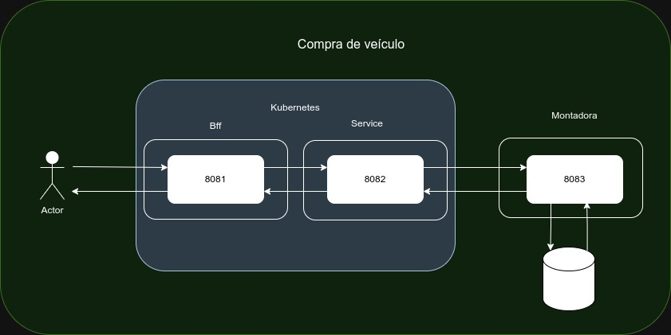

## Proposta do projeto

Projeto no qual temos 3 aplicações onde 2 estão dentro do kubernetes e 1 outro fora.
Objetivo é estudos no Kubernetes ao exercitar a configuração, manupulação e uso dos comandos para controle dos containeres. 

## Pré requisitos
Rodar o docker compose na aplicação raiz para subir o banco de dados, subir as demais aplicações, chamar o endereço para retornar os dados http://localhost:8081/veiculo/v1

### Passos executados
- Criar 3 aplicações (bffvenda, servicevenda e montadora)
- Aplicação montadora conectada no banco mongo e já inserir 3 registros ao rodar
- Aplicação servicevenda conseguir chamar aplicação montadora e retornar os dados de veículos
- Aplicação bffvenda conseguir chamar aplicação servicevenda e retornar os dados de veículos
- Fazer builds das aplicações
- Criar DockerFile para as aplicações (bffvenda e servicevenda)
- Instalar minikube

  

### Passos a serem executados
 - Gerar imagens e subir no minikube
 - Conseguir retornar os dados com as duas aplicações rodando dentro do minikube e a aplicação montadora sendo acessada externamente
 - Implementar forma de testar as aplicações usando gatling
 - Implementar uso da programação reativa afim de melhorar as respostas
 - Implementar mais cenários para exercitar o uso da programação reativa

 ### Comandos no minikube
- Iniciar minikube

  `minikube start`

- Conferir status

   `minikube status`

- Utilizar Minikube como repositório Docker (elimina necessidade de fazer "push" das imagens para um repositório externo, como o Dockerhub) 
  
    `minikube docker-env
    eval $(minikube -p minikube docker-env)`

 ### Comandos no minikube
- Build dos projetos
  
  `docker build -t microservice-bffvenda:v1 .`

  `docker build -t microservice-servicevenda:v1 .`

### Kubernetes
Observação: alguns comandos abaixo utilizam-se das flags:
--dry-run: valida se o comando é válido, porém não efetua a alteração no cluster.
-o yaml: exibe o resultado do comando no formato yaml. Útil para atender necessidades de "Infra as Code"
Ou seja, caso queira efetuar a alteração no cluster, retire estas flags.

- Criar deployments
  
  `kubectl run microservice-bffvenda --image=microservice-bffvenda:v1 --port=80 # --dry-run -o yaml`

  `kubectl run microservice-servicevenda --image=microservice-servicevenda:v1  --port=80 # --dry-run -o yaml`
